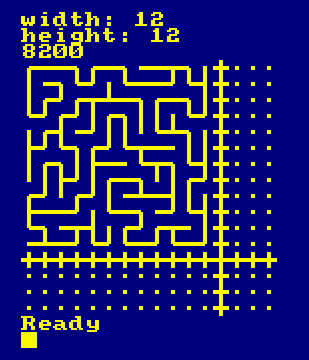
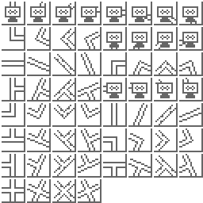
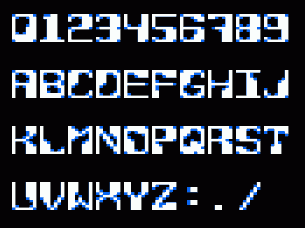
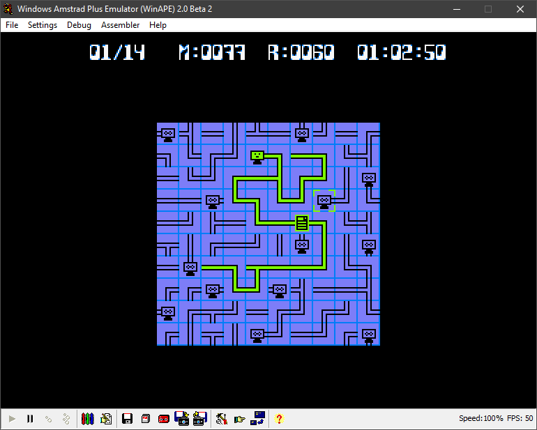

# cpc-netwalk

## Overview

This repo is a record of my _attempt_ to make a "[netwalk](https://netwalk.github.io/)" game for the
[Amstrad CPC](https://en.wikipedia.org/wiki/Amstrad_CPC), using [Z80](https://en.wikipedia.org/wiki/Zilog_Z80)
assembly language

_Note: There's a [russian wikipedia page for netwalk](https://ru.wikipedia.org/wiki/NetWalk) but no english_

## Maze algorithm

The game is really based around maze generation and traversal. I've written many maze generators, in various
languages, over the years; almost all based on [Prim's algorithm](https://en.wikipedia.org/wiki/Prim's_algorithm)

But, after reading [Jamis Buck's page on maze algorithms](http://www.jamisbuck.org/mazes/), I found a
beautiful (and simple) alternative to Prim's algorithm, which he calls the
"[Growing Tree algorithm](http://weblog.jamisbuck.org/2011/1/27/maze-generation-growing-tree-algorithm)"

This algorithm (which can actually be made to return exactly the same maze as Prim's) is naturally
stack-based, so is easier to implement in Z80. This inspired me to finally combine my interests in mazes
and in Z80 code, and make a Z80 netwalk game

## Game size

The maximum game-grid size is `16 x 16` cells. Each grid-cell doesn't need to store too much data,
so we can get away with using a single byte per cell, which means the entire grid can be stored in
`16 x 16 x 1 = 256 bytes`. This is a neat number for an 8-bit processor as we can index all cells very
quickly by manipulating a single 8-bit register

In addition to the grid itself, we also set aside another 256-byte section of memory to use as a
[stack](https://en.wikipedia.org/wiki/Stack) of cell indexes. This is needed for generating the grid.
It will also be reused later when calculating connected cells while playing the game

## Cell structure

Each cell is a single byte. The bits of this byte are used to represent different properties of the
cell. My original intuition was to use the lowest four bits to represent exits to *top*, *right*, *bottom*
and *left* respectively. Amazingly this coincided _exactly_ with the subset of the [Amstrad CPC character
set](http://cpctech.cpc-live.com/docs/cpckybd.pdf) between `&90` and `&9f` used to represent maze-type
shapes

This made writing a quick [BASIC](https://www.cpcwiki.eu/index.php/Locomotive_BASIC) program to help
debugging the maze generator very simple

### Cell bit pattern

The bit pattern for each grid-cell looks as follows, where bit 0 is the least-significant bit
(LSB), bit 7 is most-significant bit (MSB):

| Bit | Usage |
| --- | --- |
| 0 | Top exit |
| 1 | Right exit |
| 2 | Bottom exit |
| 3 | Left exit |
| 4 | Tile rotation (low bit) |
| 5 | Tile rotation (high bit) |
| 6 | Connected to power supply |
| 7 | _[unused]_ |

## Graphics

The game runs in four-colour [mode 1](http://www.cpcwiki.eu/index.php/Video_modes#Mode_1_graphics).
Tiles for the cells are 16x16 pixels and the screen is setup to be 256x256 pixels. If the grid-size
is 16x16 cells this doesn't leave _any_ room for anything apart from the game-grid (titles, banners,
scores, timers, etc) so I may have to rethink either grid-size or screen layout but we'll carry on
for now

Graphics are generated using [Retro Game Asset Studio (RGAS)](http://www.cpcwiki.eu/index.php/Retro_Game_Asset_Studio)

There are 15 possible different combinations of exits for each cell and, for each of these, there
are four rotation positions (to allow for relatively smooth rotation animation). In addition to
these is another set of 15 "connected" cells (ie with a different colouring to represent being
connected to the power supply)

In mode 1 each byte represents four pixels so each tile sprite takes `64 bytes`. Total memory required
for our tile sprites is `64 x 15 (exit combinations) x 5 (rotations plus connected) = 4800 bytes`. In
actual fact, it makes calculations much simpler if we allocate space for 16 exit combinations (ie include
spaces for tiles representing cells that would have zero exits, even though they won't appear in the game)
which brings the size to `5120 bytes / 5KB`. Rather than wasting this space, we can use these extra tiles
to hold other sprites used in the game, such as the power supply tile and reticle position indicator

In addition to the tiles themselves, I had a stab at creating a chunky retro font. Surprisingly this
took me less than one day for design and pixel wrangling. Each character is `7 x 11 pixels`. There
are 39 characters so this easily fits into less than `1KB` (`2 x 11 x 39 = 858 bytes`)

## Progress

This is how the game looks at the moment, running in the [WinAPE](http://www.winape.net/) emulator.
The info bar at the top of the screen shows how many terminals are currently connected [1 terminal
connected out of 14 total], the count of moves [77] and rotations [60], and the time taken
so far

Here's a quick list of tasks in the approximate order I intend to do them. Not complete and probably
going to change quite significantly as I gradually get stuff done...

- [x] Maze generation
- [x] Draw tile sprites
- [x] Render a single tile
- [x] Render whole game-grid
- [x] Show currently selected cell in rendered grid
- [x] Navigate around the grid using keyboard
- [x] Animate tile rotation
- [x] Add power supply tile
- [x] Calculate which cells are connected to power supply
- [x] Display connected tiles
- [x] Shuffle rotations before game
- [ ] Recognise when game is complete (ie all terminals connected)
- [x] Allow different grid-sizes
- [x] Add timer/countdown
- [ ] Game menus
- [ ] Logo graphics
- [ ] Ability to pause game
- [ ] Add music player
- [ ] Sound effects
- [ ] Compose original music
- [ ] Loading screen
- [ ] Deploy playable version online
